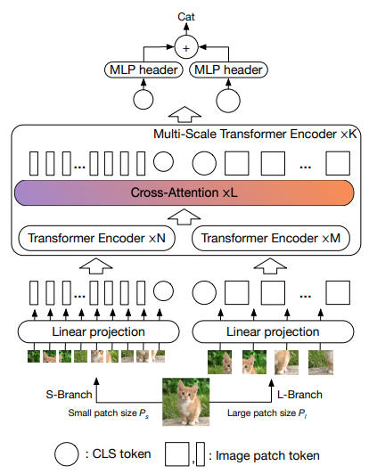

## Cross ViT

</img>

"The recently developed vision transformer (ViT) has achieved promising results on image classification compared to convolutional neural networks. Inspired by this, in this paper, we study how to learn multi-scale feature representations in transformer models for image classification. To this end, we propose a dual-branch transformer to combine image patches (i.e., tokens in a transformer) of different sizes to produce stronger image features. Our approach processes small-patch and large-patch tokens with two separate branches of different computational complexity and these tokens are then fused purely by attention multiple times to complement each other. Furthermore, to reduce computation, we develop a simple yet effective token fusion module based on cross attention, which uses a single token for each branch as a query to exchange information with other branches. Our proposed cross-attention only requires linear time for both computational and memory complexity instead of quadratic time otherwise. Extensive experiments demonstrate that our approach performs better than or on par with several concurrent works on vision transformer, in addition to efficient CNN models. For example, on the ImageNet1K dataset, with some architectural changes, our approach outperforms the recent DeiT by a large margin of 2\% with a small to moderate increase in FLOPs and model parameters." - Chun-Fu Chen, Quanfu Fan, Rameswar Panda

## Acknowledgement:
I have been greatly inspired by the brilliant code of [Dr. Phil 'Lucid' Wang](https://github.com/lucidrains). Please check out his [open-source implementations](https://github.com/lucidrains) of multiple different transformer architectures and [support](https://github.com/sponsors/lucidrains) his work.

## Research Paper:
- https://arxiv.org/abs/2103.14899

## Official repository:
- https://github.com/IBM/CrossViT

## Usage:

```python
import numpy

key = jax.random.PRNGKey(0)

img = jax.random.normal(key, (1, 256, 256, 3))

v = CrossViT(
        image_size = 256,
        num_classes = 1000,
        depth = 4,               # number of multi-scale encoding blocks
        sm_dim = 192,            # high res dimension
        sm_patch_size = 16,      # high res patch size (should be smaller than lg_patch_size)
        sm_enc_depth = 2,        # high res depth
        sm_enc_heads = 8,        # high res heads
        sm_enc_mlp_dim = 2048,   # high res feedforward dimension
        lg_dim = 384,            # low res dimension
        lg_patch_size = 64,      # low res patch size
        lg_enc_depth = 3,        # low res depth
        lg_enc_heads = 8,        # low res heads
        lg_enc_mlp_dim = 2048,   # low res feedforward dimensions
        cross_attn_depth = 2,    # cross attention rounds
        cross_attn_heads = 8,    # cross attention heads
        dropout = 0.1,
        emb_dropout = 0.1
    )

init_rngs = {'params': jax.random.PRNGKey(1), 
            'dropout': jax.random.PRNGKey(2), 
            'emb_dropout': jax.random.PRNGKey(3)}

params = v.init(init_rngs, img)
output = v.apply(params, img, rngs=init_rngs)
print(output.shape)

n_params_flax = sum(
    jax.tree_leaves(jax.tree_map(lambda x: numpy.prod(x.shape), params))
)
print(f"Number of parameters in Flax model: {n_params_flax}")
```

## Author:
- Enrico Shippole

## Citations:
```bibtex
@misc{chen2021crossvit,
    title   = {CrossViT: Cross-Attention Multi-Scale Vision Transformer for Image Classification},
    author  = {Chun-Fu Chen and Quanfu Fan and Rameswar Panda},
    year    = {2021},
    eprint  = {2103.14899},
    archivePrefix = {arXiv},
    primaryClass = {cs.CV}
}
```
```bibtex
@software{flax2020github,
  author = {Jonathan Heek and Anselm Levskaya and Avital Oliver and Marvin Ritter and Bertrand Rondepierre and Andreas Steiner and Marc van {Z}ee},
  title = {{F}lax: A neural network library and ecosystem for {JAX}},
  url = {http://github.com/google/flax},
  version = {0.5.0},
  year = {2020},
}
```
```bibtex
@software{jax2018github,
  author = {James Bradbury and Roy Frostig and Peter Hawkins and Matthew James Johnson and Chris Leary and Dougal Maclaurin and George Necula and Adam Paszke and Jake Vander{P}las and Skye Wanderman-{M}ilne and Qiao Zhang},
  title = {{JAX}: composable transformations of {P}ython+{N}um{P}y programs},
  url = {http://github.com/google/jax},
  version = {0.3.13},
  year = {2018},
}
```
